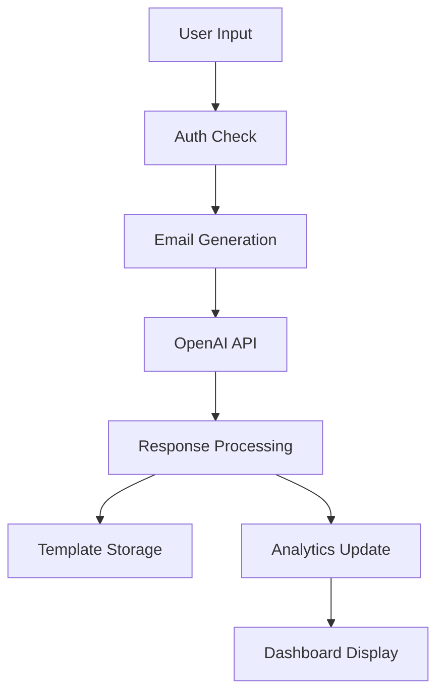

# ReplyRocket.io - Technical Architecture

## System Overview

ReplyRocket.io is a React-based web application that leverages AI to help users generate professional email responses. The system is built with a modern tech stack and follows a component-based architecture.

## Core Components

### 1. Authentication System
- Implemented using Supabase Auth
- JWT-based authentication
- Protected routes using React Router
- Session management and persistence

### 2. Email Generation Engine
- OpenAI GPT integration
- Context-aware response generation
- Tone customization
- Template management system

### 3. Analytics Dashboard
- Real-time usage statistics
- Response history tracking
- Performance metrics
- User behavior analytics

### 4. Subscription Management
- Stripe integration
- Tiered pricing model
- Usage quota management
- Payment processing

## Data Flow



## Database Schema

### Users Table
```sql
CREATE TABLE users (
  id UUID PRIMARY KEY DEFAULT uuid_generate_v4(),
  email TEXT UNIQUE NOT NULL,
  created_at TIMESTAMP WITH TIME ZONE DEFAULT CURRENT_TIMESTAMP,
  subscription_tier TEXT DEFAULT 'free',
  monthly_responses_used INTEGER DEFAULT 0,
  monthly_responses_limit INTEGER DEFAULT 100
);
```

### Email Templates Table
```sql
CREATE TABLE email_templates (
  id UUID PRIMARY KEY DEFAULT uuid_generate_v4(),
  user_id UUID REFERENCES users(id),
  template_name TEXT NOT NULL,
  template_content TEXT NOT NULL,
  category TEXT,
  created_at TIMESTAMP WITH TIME ZONE DEFAULT CURRENT_TIMESTAMP
);
```

### Email History Table
```sql
CREATE TABLE email_history (
  id UUID PRIMARY KEY DEFAULT uuid_generate_v4(),
  user_id UUID REFERENCES users(id),
  customer_email TEXT NOT NULL,
  generated_response TEXT NOT NULL,
  context_provided TEXT,
  tone_requested TEXT,
  created_at TIMESTAMP WITH TIME ZONE DEFAULT CURRENT_TIMESTAMP
);
```

## Security Considerations

1. **Authentication**
   - JWT token validation
   - Session management
   - Rate limiting

2. **API Security**
   - Environment variable protection
   - API key rotation
   - Request validation

3. **Data Protection**
   - Email content encryption
   - PII handling
   - GDPR compliance

## Performance Optimization

1. **Frontend**
   - React component memoization
   - Lazy loading of routes
   - Image optimization
   - Bundle size optimization

2. **Backend**
   - Response caching
   - Database indexing
   - Query optimization

## Monitoring and Logging

1. **Error Tracking**
   - Error boundary implementation
   - Error logging and reporting
   - User feedback collection

2. **Performance Monitoring**
   - API response times
   - Component render times
   - Resource utilization

## Development Workflow

1. **Local Development**
   - Environment setup
   - Development server
   - Hot reloading

2. **Testing**
   - Unit tests
   - Integration tests
   - End-to-end tests

3. **Deployment**
   - CI/CD pipeline
   - Environment management
   - Version control

## Future Considerations

1. **Scalability**
   - Horizontal scaling
   - Load balancing
   - Caching strategies

2. **Feature Roadmap**
   - Multi-language support
   - Advanced analytics
   - Custom AI model training
   - Mobile application

3. **Integration Possibilities**
   - Email client plugins
   - CRM integrations
   - Team collaboration features 